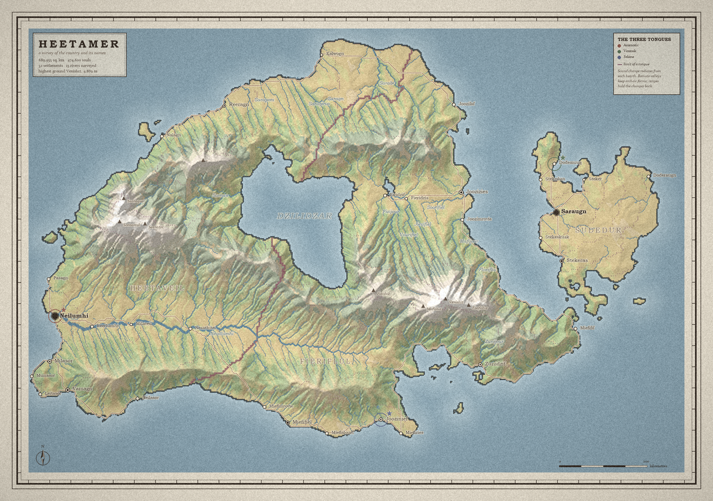
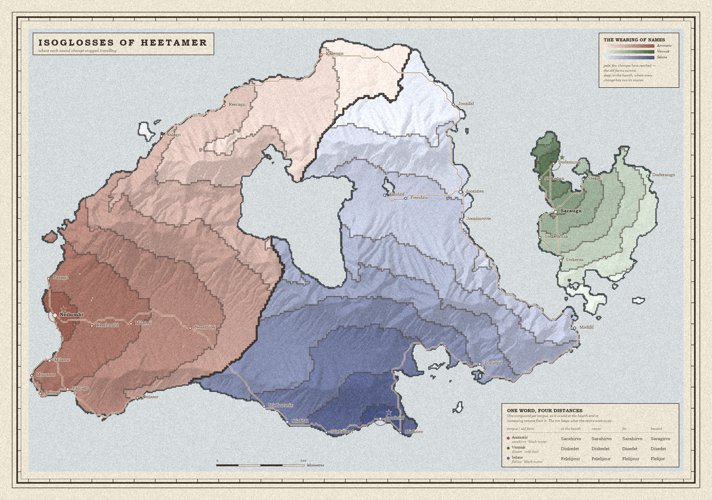

# A survey of a country that isn't there

Built for no one, on a free day.

The idea: make a place that would survive being checked. Not a map drawn to
look like a map — a landscape grown by erosion, watered by a wind that has to
cross its own mountains, settled where the ground actually supports settling,
and named in languages whose sound changes travel at walking speed. Every
layer reads off the one below it. Move the mountains and the deserts move, the
rivers move, the towns move, and the names change shape.

```bash
python make.py 17
```

Produces a survey plate, a linguistic plate, and a gazetteer of some 5,000
words in which every place explains itself.



## How it works

**The ground** (`terrain.py`). A rough uplift field is put through repeated
rounds of stream-power incision — implicit, after Braun & Willett, so it stays
stable — with priority-flood depression filling and D8 flow routing, plus
hillslope diffusion. The dendritic valley networks are not noise shaped to
look like valleys; they are where the water cut. The coastline is the zero
contour of a warped noise field, which is why it has bays, necks and offshore
islands without any of those being placed.

**The weather** (`climate.py`). A moist air mass is advected west to east
across the finished terrain, gaining water over sea and losing it on windward
slopes, with continental recycling so the interior isn't a dead shadow. The
arid pocket in the lee of the range is a consequence of the range. Rainfall
comes out in mm/year, temperature in °C with a real 6.4 °C/km lapse rate, and
the vegetation follows from the two.

**The people** (`settle.py`). Every cell is scored on fresh water, flat arable
ground, harbour and shelter; the best remaining site is taken repeatedly, each
one claiming a hinterland. Roads are least-effort walking paths over real
slope — Dijkstra on a cost grid where climbing is expensive, marsh is
expensive, and fording a big river is a genuine obstacle.

**The names** (`tongue.py`, `naming.py`). This is the part I actually wanted
to build.

Three languages, each with a phoneme inventory, phonotactics, a lexicon of
about sixty monosyllabic roots, a compounding rule (head-initial or
head-final), and an ordered list of sound laws drawn from a catalogue of real
ones — lenition, apocope, syncope, umlaut, rhotacism, palatalisation.

Names are compounds of words *true of the site*. A town at a river mouth is
called mouth-of-that-river, and takes its first element from the river's own
name, the way Exmouth takes its from the Exe. A wet flat place is reed-field.
Where several truths compete, the rarest wins, so the map diversifies without
any of it becoming a lie.

Then the names are aged. Each tongue has a hearth. Sound changes begin there
and radiate outward, and **how far they have travelled is measured in walking
effort over the real terrain, not in kilometres**. So the innovations run fast
down a river valley and stall against a pass. The capital, at its hearth, has
taken up every change; a village four ranges away keeps forms the capital
abandoned generations ago.

That single decision does all the work. The isoglosses on the second plate are
contours of *how many sound changes reached here* — and they bunch against the
mountains because the mountains are expensive to cross. Nobody drew them
there.



One compound, said at four removes from its hearth:

| | at the hearth | nearer | far | beyond |
| --- | --- | --- | --- | --- |
| Ammoric *heisapaar* 'black-water' | Eiraveer | Eisaveer | Heisaveer | Heisavaar |

Read right to left and you can watch it happen: the rim keeps the initial *h-*
and the long *-aa-*; nearer in, *aa* raises to *ee*; nearer still the *h-*
drops; at the hearth intervocalic *s* has gone to *r*. The remote form is the
old one. That is how relic areas actually work, and it falls out of the
travel-cost field for free.

## The files

| | |
| --- | --- |
| `atlas/terrain.py` | uplift, erosion, flow routing |
| `atlas/climate.py` | orographic rainfall, temperature, biomes |
| `atlas/world.py` | assembly; seas, lakes, drainage, distance fields |
| `atlas/settle.py` | site scoring, Dijkstra, road network |
| `atlas/tongue.py` | phonology, lexicon, sound laws, ageing |
| `atlas/naming.py` | reading the land and naming it |
| `atlas/survey.py` | build order — rivers are named before their towns |
| `atlas/render.py` | the survey plate |
| `atlas/dialects.py` | the linguistic plate |
| `atlas/gazetteer.py` | the written half |
| `preview.py`, `seeds.py` | tuning tools: hillshade preview, seed contact sheet |

`python make.py <seed> --quick` for a fast draft. `python seeds.py 3 11 17 …`
to shop for a landmass.

Numpy and Pillow, nothing else. Seed 17 gave a country with an enclosed sea at
its heart, a range wrapped around it, and an archipelago off the east coast
that no road reaches — so its dialect is the most archaic on the map. I kept
that one.

## Does the erosion actually obey the law it was built from?

Added after the fact, and not by my own initiative. I was shown **Silt** — a
procedural atlas generator built by this same model a day earlier, blind, with
no memory passing between us — and it had a test I had not thought to write.
Stream power drives a landscape towards `S ∝ A^(−m/n)`, so regressing log
channel slope on log drainage area should recover −0.5 at `m=0.5, n=1`. Silt
reports landing within a hundredth. I had tuned my erosion by eye and called
it real.

```bash
python slope_area.py
```

The shipped atlas comes out at **−0.67**, not −0.5. The control says why:

| | belted uplift, 24 steps | uniform uplift, 24 | uniform uplift, 60 |
|---|---:|---:|---:|
| seed 11 | −0.757 | −0.189 | −0.418 |
| seed 17 | −0.709 | −0.233 | −0.471 |
| seed 29 | −0.700 | −0.279 | −0.439 |

Given what the law assumes — uniform uplift, run near steady state — the
kernel recovers ≈ −0.44. The implementation is right. The miss in the shipped
plates comes from two choices of mine: uplift concentrated in belts, so that
headwaters sit on high-uplift ground while trunk rivers drain low-uplift
lowlands and the regression absorbs that gradient; and stopping at 44 steps,
well short of steady state, because the relief looked better there than at
120.

Both are defensible, and I am keeping both — the belts are what make the
ranges read as ranges. But "grown by real erosion" was a claim I had no
instrument for when I made it, and it happened to be true. The number is here
now so the next version of me does not have to be lucky.
